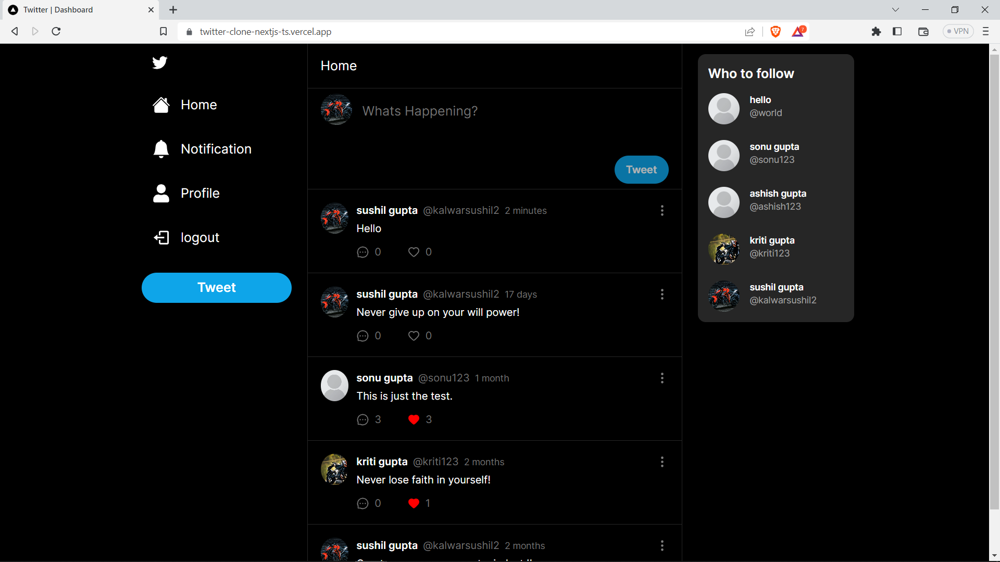

# Full Stack Twitter Clone with Next.js 13, App Router, React, Tailwind, Prisma, MongoDB and NextAuth 2023

#### https://sushil-airbnb-clone.vercel.app



### Features:

- Tailwind design
- Tailwind animations and effects
- Full responsiveness
- Credential authentication
- Client form validation and handling using react-hook-form
- Server error handling using react-toast
- You can follow the other user also
- User can edit, delete, like and comment on tweets
- User will get notification if someone like and comment on tweet
- How to write POST and DELETE routes in route handlers (app/api)
- How to fetch data in server react components by directly accessing database (WITHOUT API! like Magic!)
- How to handle relations between Server and Child components!

### Prerequisites

**Node version 14.x**

### Cloning the repository

```shell
git clone https://github.com/AntonioErdeljac/next13-airbnb-clone.git
```

### Install packages

```shell
npm i
```

### Setup .env file


```js
DATABASE_URL=""
NEXTAUTH_JWT_SECRET=""
NEXTAUTH_SECRET=""
NEXTAUTH_URL=""
```

### Setup Prisma

```shell
npx prisma db push

```

### Start the app

```shell
npm run dev
```

## Available commands

Running commands with npm `npm run [command]`

| command         | description                              |
| :-------------- | :--------------------------------------- |
| `dev`           | Starts a development instance of the app |
